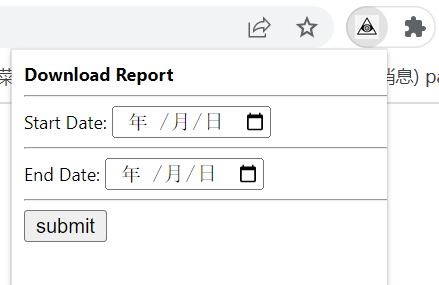

# 亚马逊卖家助手谷歌插件

## 背景
亚马逊后台的数据都是业务人员手动导出成 csv ，然后再由开发人员将 csv  保存到数据库，现在需要将后台的数据用自动化的方法直接导入数据库，省略人工成本

## 技术
### 具体方案
出于账号安全及开发成本的考虑，决定采用谷歌插件加web服务的方法采集数据

### 代码开发
前端部分根据教程开发谷歌插件，后端部分用 flask  开发接口完成数据清洗及入库

### 预览

有两个功能：
1.点击submit按钮即可下载对应日期的数据；
2.每次打开对应的亚马逊后台后自动下载过去7天的数据；
